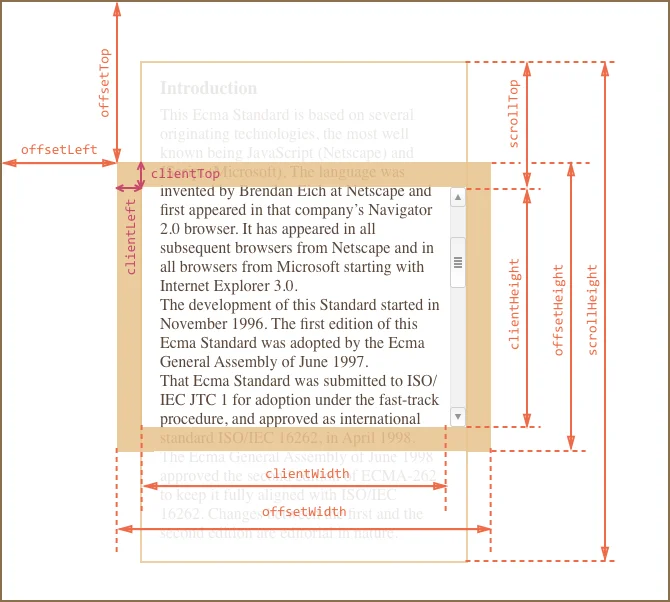

## Для элемента
:material-eye: свойство только для чтения
:material-pencil: свойство можно изменять

| `Element` | Описание |
| -----------   | ----------- |
| :material-eye: `clientWidth` | внутренняя ширина элемента + `padding`|
| :material-eye: `clientHeight` | внутренняя высота элемента + `padding`|
| :material-eye: `clientLeft` | эквивалентен css свойству `border-left` |
| :material-eye: `clientTop` | эквивалентен css свойству `border-top` |
| :material-eye: [`scrollHeight`](#_4) | полная внутренняя высота, включая прокрученную область (которую не видно) |
| :material-eye: [`scrollWidth`](#_4) | полная внутренняя ширина, если прокрутки нет она равна `clientWidth`. |
| :material-pencil: `scrollLeft` | невидимая ширина прокрученного контента слева. Можно установить значение |
| :material-pencil: [`scrollTop`](#_5) | невидимая высота прокрученного контента сверху. Можно установить значение |

| `HTMLElement` | Описание |
| -----------   | ----------- |
| :material-eye: `offsetWidth` | ширина элемента включая `padding` + `border` |
| :material-eye: `offsetHeight` | высота элемента с учётом `padding` + `border` |
| :material-eye: [`offsetParent`](#_6) | ближайший предок от которого позиционируется элемент |
| :material-eye: [`offsetTop`](#_6) | эквивалентен css свойству `top` |
| :material-eye: [`offsetLeft`](#_6) | эквивалентен css свойству `left` |

## Для окна
| Свойство | Описание | 
| -----------------------   | ------------------------------ | 
| :material-eye: `document.documentElement.clientWidth`   |  Ширина окна (без учета скролла) |
| :material-eye: `document.documentElement.clientHeight`   |  Высота окна (без учета скролла) |
| :material-eye: `window.innerWidth` | Ширина окна (с учетом скролла) |
| :material-eye: `window.innerHeight` | Высота окна (с учетом скролла) |
| `window.innerWidth - document.documentElement.clientWidth` | Получили ширину скролла |

## Для документа (страницы)
| Свойство | Описание | 
| -----------------------   | ------------------------------ | 
| :material-eye: `document.documentElement.scrollHeight` |  вся высота документа (включая скрытую) |
| :material-eye: `document.documentElement.scrollWidth` |  вся ширина документа (включая скрытую) |
| :material-eye: `window.pageYOffset` | Высота прокрученного (скрытого) документа сверху от окна (alias for `scrollY`)|
| :material-eye: `window.pageXOffset` | Ширина прокрученного (скрытого) документа слева от окна (alias for `scrollX`)|

## Координаты мыши
| `MouseEvent` | Описание | 
| -----------------------   | ------------------------------ | 
| :material-eye: `clientX/Y` |  координаты мыши относительно окна  |
| :material-eye: `pageX/Y` |  координаты мыши относительно HTML-документа |
| :material-eye: `offsetX/Y` | координаты мыши относительно элемента, на котором вызвано событие |
| :material-eye: `screenX/Y` | координаты мыши относительно экрана монитора |

## Иллюстрирующие картинки 
### { style="margin:auto; display:block; height: 400px" }
### { style="margin:auto; display:block" }
### { style="margin:auto; display:block" }
### { style="margin:auto; display:block" }
### { style="margin:auto; display:block" }

