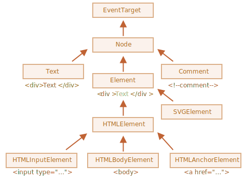

## Классы DOM-узлов

Каждый DOM-узел принадлежит определённому классу. Классы формируют иерархию. Весь набор свойств и методов является результатом наследования.

{ style="margin:auto; display:block" }

- **EventTarget** - это корневой "абстрактный" класс. Объекты этого класса никогда не создаются. Он служит основой, благодаря которой все DOM-узлы поддерживают "события".
- **Node** - также является "абстрактным" классом, и служит основой для DOM-узлов. Он обеспечивает базовую функциональность: `parentNode`, `nextSibling`, `childNodes` и т.д. Объекты класса `Node` никогда не создаются. Но есть определённые классы узлов, которые наследуют от него: `Text` - для текстовых узлов, `Element` - для узлов-элементов и `Comment` - для узлов-комментариев.
- **Element** - это базовый класс для DOM-элементов. Он обеспечивает навигацию на уровне элементов: `nextElementSibling`, `children` и методы поиска: `getElementsByTagName`, `querySelector`. Браузер поддерживает не только HTML, но также XML и SVG. Класс Element служит базой для следующих классов: `SVGElement`, `XMLElement` и `HTMLElement`.
- **HTMLElement**  - является базовым классом для всех остальных HTML-элементов. От него наследуют конкретные элементы:
    - **HTMLInputElement** - класс для тега `<input>`,
    - **HTMLBodyElement** - класс для тега `<body>`,
    - **HTMLAnchorElement** - класс для тега `<a>`,
    - ...и т.д, каждому тегу соответствует свой класс, который предоставляет определённые свойства и методы.

### Узнать имя класса DOM-узла
```js
document.body.constructor.name ; // HTMLBodyElement (1)
```

1.  Constructor - ссылается на конструктор класса, и в свойстве constructor.name содержится его имя

```JavaScript
document.body instanceof HTMLBodyElement // true (1)
document.body instanceof HTMLElement // true
document.body instanceof Element  // true
document.body instanceof Node // true
document.body instanceof EventTarget // true

document.body instanceof Text // false (2)
```

1.  Проверить наследование можно при помощи `instanceof`
2.  Объект `body` не наследуется от класса `Text`

### Имя элемента tagName и узла nodeName
* Свойство `tagName` есть только у элементов класса Element. У узлов таких как Comment и Text будет значение `undefined`
* Свойство `nodeName` определено для любых узлов Node
* Есть еще свойство `localName` только для чтения, возвращает локальную часть полного имени этого узла.

```HTML title="HTML"
<body>
    <!-- комментарий -->
    <h1>Заголовок</h1>
</body>
```
```JavaScript title="JavaScript"
document.body.firstChild.tagName; // undefined (не элемент)
document.body.firstChild.nodeName; // #text (1)
document.body.firstChild.nextSibling.nodeName; // #comment
document.body.lastChild.nodeName; // H1 
document.body.lastChild.tagName; // H1 (2)
```

1.  Пробелы и переводы строки – это полноправные символы, как буквы и цифры. Они образуют текстовые узлы и становятся частью дерева DOM.
2.  :point_up: Имена тегов (кроме XHTML) всегда пишутся в верхнем регистре. Будет выведено H1 вне зависимости от того, как записан тег в HTML `<h1>` или `<H1>`

## Получить или изменить содержимое элемента и узла 
### **innerHTML и outerHTML**
Запомните `innerHTML` и `outerHTML` работают только с  Element, для узлов Text и Comment они неприменимы

```HTML title="HTML"
<div id="elem">Привет <b>Мир</b></div>
```

* Свойство `innerHTML` - Возвращает содержимое элемента. А при присваивании заменяет содержимое
  ```js
  elem.innerHTML // Привет <b>Мир</b>

  elem.innerHTML = "<p>Упс</p>" 
  document.body.innerHTML // <div id="elem"><p>Упс</p></div>

  elem.innerHTML += "Hello" // (1)
  ```

    1.  `innerHTML +=` Следует пользоваться с большой осторожностью, так как:
        * Старое содержимое удаляется.
        * На его место становится новое значение innerHTML (с добавленной строкой).

* Свойство `outerHTML` в Element похоже на innerHTML, но его значение включает сам элемент.
  ```js 
  elem.outerHTML // <div id="elem">Привет <b>Мир</b></div>
  elem.outerHTML = '<p>Упс</p>' // Заменяем сам элемент
  elem.outerHTML // ReferenceError: elem is not defined (1)
  ```

    1.  Тег `<div>` с `id="elem"` перезаписан и следовательно удалился из дерева 

!!! note ""

    Если innerHTML вставляет в документ тег `<script>` – он становится частью HTML, но не запускается.
    Так что можно не опасаться что кто то вставит Вредоносный скрипт

### **nodeValue и data**
`nodeValue` -  Текстовое содержимое узла Text или Comment.  
`nodeValue и data.` Эти свойства очень похожи при использовании, есть лишь небольшие различия в спецификации.

```HTML
<body>
  Привет
  <!-- Комментарий -->
  <script>
    document.body.firstChild.data; // Привет
    document.body.firstChild.nextSibling.data; // Комментарий
    // Изменяем содержимое комментария
    document.body.firstChild.nextSibling.data = "123" 
  </script>
</body>
```

### **textContent - просто текст**
Свойство `textContent` определено в классе `Node`, поэтому оно работает для
узлов `Text` и `Element`. В случае узлов `Element` оно находит и возвращает весь
текст во всех потомках элемента.
```HTML title="Получаем текст с узла"
<div id="news">
  <h1>Срочно в номер!</h1>
  <p>Марсиане атаковали человечество!</p>
</div>

<script>
  news.textContent // Срочно в номер! Марсиане атаковали человечество!
</script>
```

Сравнение `textContent` с `innerHTML`

* С `innerHTML` вставка происходит «как HTML», со всеми HTML-тегами.
* С `textContent` вставка получается «как текст», все символы трактуются буквально.


=== "Code"

    ```HTML
    <div id="elem1"></div>
    <div id="elem2"></div>

    <script>
    elem1.innerHTML = "<b>Винни-пух!</b>";
    elem2.textContent = "<b>Винни-пух!</b>";
    </script>
    ```

=== "Результат"

    **Винни-пух!**  
    &lt;b&gt;Винни-пух!&lt;/b&gt;


