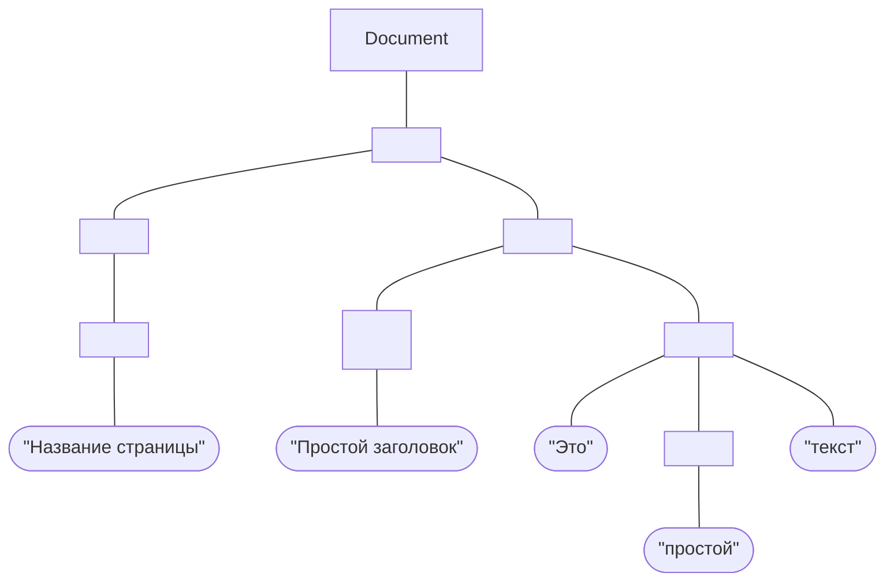

## Дерево DOM

Одним из наиболее важных объектов в программировании на JavaScript с клиентской стороны является тип(класс) `Document`, который представляет HTML-страницу, отображаемая в окне или на вкладке браузера.  
АРI-интерфейс[^1] для работы с HTML-страницами известен как объектная модель документа DOM.  
DOM представляет документ как иерархическое дерево узлов, позволяя добавлять, удалять и изменять отдельные части страницы.

!!! Info "Пример узла"

    В этом примере у документа есть единственный дочерний узел - элемент `<html>`, который называется document element - 
    это самый внешний элемент в документе, содержащий все остальные элементы.  
    Узел непосредственно выше какого-то узла является родителем этого узла.
    Узлы на уровень ниже еще одного узла являются дочерними
    для этого узла. Узлы на том же самом уровне и с тем же самым родителем являются родственными.
    Набор узлов, расположенных на любое количество уровней
    ниже отдельного узла, являются потомками данного узла. А родитель, прародитель
    и все остальные узлы выше некоторого узла являются его предками.
  
Для каждого HTML-элемента в документе имеется соответствующий объект `Element`,
для текста есть соответствующий объект `Text`. 
Классы `Element` и `Text` и сам класс `Document` являются
подклассами более универсального класса `Node`.

## DOM – в инструментах разработчика браузера.
Включите инструменты разработчика и перейдите на вкладку Elements.

В правой части инструментов разработчика находятся следующие подразделы:

* **Styles** – здесь мы видим CSS, применённый к текущему элементу: правило за правилом, включая встроенные стили (выделены серым). Почти всё можно отредактировать на месте, включая размеры, внешние и внутренние отступы.
* **Computed** – здесь мы видим итоговые CSS-свойства элемента, которые он приобрёл в результате применения всего каскада стилей (в том числе унаследованные свойства и т.д.).
* **Event Listeners** – в этом разделе мы видим обработчики событий, привязанные к DOM-элементам (мы поговорим о них в следующей части учебника).
* … и т.д.

При работе с DOM нам часто требуется применить к нему JavaScript. Например: получить узел и запустить какой-нибудь код для его изменения, чтобы посмотреть результат.

* На вкладке Elements выберите первый элемент `<li>`
* Нажмите ++esc++ – прямо под вкладкой Elements откроется Console.
* Последний элемент, выбранный во вкладке Elements, доступен в консоли как `$0`; предыдущий, выбранный до него, как `$1` и т.д.
* Теперь мы можем запускать на них команды. Например `$0.style.background = 'red'` сделает выбранный элемент красным, как здесь:

## Element
Обычные узлы — это HTML-теги, а текстовые узлы — текст внутри тегов. **API-интерфейс DOM** включает методы для создания этих тегов(Element) и текстов(Text),
а также для их вставки в документ.

Каждый HTML-тег соответствует классу JavaScript и каждое вхождение тега в документе представлено экземпляром этого класса.
Например, тег `<body>` представлен экземпляром HTMLBodyElement,а тег `<table>` — экземпляром `HTMLTableElement`. 

Объекты элементов имеют свойства, которые соответствуют атрибутам HTML-тегов. Скажем, экземпляры `HTMLImageElement`, представляющие теги
``, имеют свойство `src` , которое соответствует атрибуту `src` тега. Начальным значением свойства `src` будет значение атрибута, которое
указано в ``, и установка этого свойства в коде JavaScript
изменяет значение атрибута (плюс вынуждает браузер загрузить
и отобразить новое изображение). В некоторых классах элементов определены
дополнительные методы. Например, в классах `HTMLAudioElement` и
`HTMLVideoElement` определены методы наподобие `play()` и `pause()` для управления
воспроизведением аудио- и видеоклипов.

[^1]: API (Application Programming Interface или интерфейс программирования приложений) — это совокупность инструментов и функций в виде интерфейса для создания новых приложений, благодаря которому одна программа будет взаимодействовать с другой. Это позволяет разработчикам расширять функциональность своего продукта и связывать его с другими.

